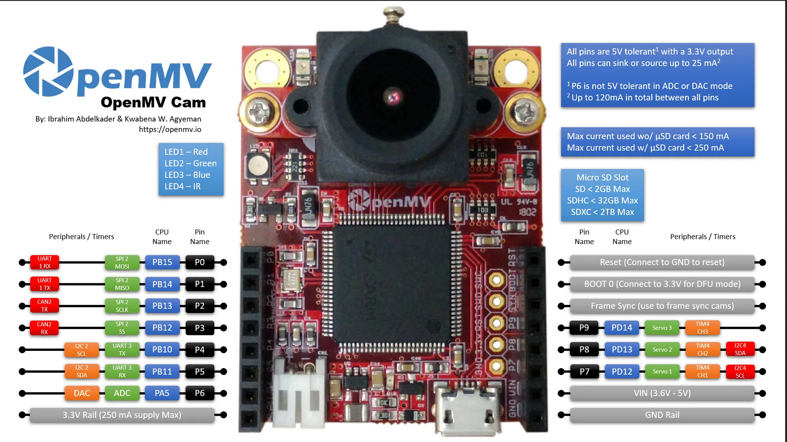

# HITL simulation

The Hardware in the loop (**HITL**) simulation is aimed at testing the communication between the OpenMV Camera H7P and the pixhawk flight controller.  

## OpenMV Camera setup
  1. Insert a uSD card into the proper slot of the OpenMV cam. The uSD is needed to host the neural network, since it's around 6 MB this would slow the running too much if used on the native FLASH memory;
  2. Load the *main.py* and the *landing_quant.tflite* files into the uSD. The camera is treated as a normal USB drive, so it's sufficient to drag and drop them into the drive folder. 

## QGroundControl setup
  1. Connect the pixhwak4 mini autopilot to the PC via USB connection
  2. Open QGroundControl
  3. Enable HITL mode
      * Open **Setup > Safety** section;
      * Enable HITL mode selecting **Enabled** from the list;
  4. In the **Setup > Airframe** section select the **Quadcopter X** vehicle. After that, click op **Apply and Restart** on the top right corner of the *Airframe Setup* page;
  5. On the *General* page of the *settings* menu, uncheck all the boxes except for **UDP**; 
  6. Close *QGroundControl* and disconnect the pixhawk4 mini for the PC.

## Hardware setup and simulation

The hardware we used is:
  - [OpenMV Camera H7 Plus](https://openmv.io/products/openmv-cam-h7-plus) for running the main code script managing the drone navigation
      and the landing pad alignment routines;
  - [Pixhawk4 mini](http://www.holybro.com/product/pixhawk4-mini/) is the flight controller with witch the OpenMV Camera communicates via MAVLink protocol 
  in order to control the drone.
  
In order to replicate the HITL simulation one should follow these steps:
  1. If not done already, connect the *Pixhawk4 mini* to the PC via USB;
  2. Connect the **PIN 4** (TX) and **PIN 5** (RX) (see the below image for referece) of the OpenMV cam to the telem port with a proper adapter to the **TELEM** port of the pixhawk4 mini.
  3. Make sure *QGroundControl* is not running! Build the PX4 firmware with *Gazebo* 
  ```Shell
    $ cd <path-to>/PX4-Autopilot
    $ DONTRUN=1 make px4_sitl_default gazebo
  ```
  4. Setup the environment variables:
  ```Shell
    $ source Tools/simulation/gazebo/setup_gazebo.bash $(pwd) $(pwd)/build/px4_sitl_default
  ```
  5. Run Gazebo in HITL mode:
  ```Shell
    $ gazebo Tools/simulation/gazebo/sitl_gazebo/worlds/hitl_iris.world
  ``` 
  If the terminal displays the message "Serial port closed" it means that there is a problem in the connection with the pixhawk4 mini. Thus close the terminal, disconnect and reconnect the flight controller and retry. It may be also possible that the port of the flight controller is not set correctly. To ensure that that's not the case open the vehicle model file (**Tools/simulation/gazebo/sitl_gazebo/models/iris_hitl/iris_hitl.sdf**) and replace the *SerialDevice* parameter with */dev/ttyACM0* if necessary;

  6. Once Gazebo is stared, connect the OpenMV camera to the PC via USB being careful to don't connect to the OpenMV IDE. This connection is just for supply the voltage to the camera to make it work and the UART bus must be free. Once the camrea is supplied with power, the main.py program is executed and so the algorithm. 
  

  
