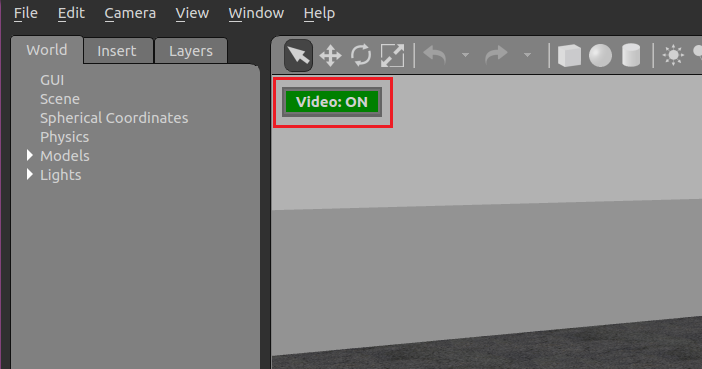

# SITL simulation

Software in the loop (**SITL**) simulation allows to test the algorithm working without using any piece of hardware. 
This is of course advantageous both from safety and economic point of view. This folder contains all the necessary
files to replicate the simulation 

## Content

This folder contains the following files/folders:
  - **SITL_simulation.py**: this is the main code to be executed on the PC for the simulation to run;
  - **typhoon_h480.world**: this is the world file that is loaded once the simulation is started;
  - **landing_pad_model**: this folder contains all the files required to generate the landing pad model inseide the simulation.

## Files usage

In the first place, in order to replicate the simulation, one must have followed all the steps required for the installation of 
the PX4 autopilot avalibale in the [PX4 Autopilot User Guide](https://docs.px4.io/main/en/). 
Once all the necessary dependacies are correctly installed, one can proceed with placing the *landing_pad_model* folder and the *typhoon_h480.world* file
into the appropriate folders:
  ```Shell
  $ cd ~/Automatic_Landing 
  $ cp landing_pad_model <path-to>/PX4-Autopilot/Tools/sitl_gazebo/models 
  $ cp typhoon_h480.world <path-to>/PX4-Autopilot/Tools/sitl_gazebo/worlds
  ```
**NOTICE**: once the file *typhoon_h480.world* is copied into the /worlds folder it will replace the old file. So, if one is interested
in preserving the original file, should do a backup of it. 

## Simulation 
Running the simulation is very much straight forward now. Simply type in the shell:
  ```Shell
    $ cd <path-to>/PX4-Autopilot
    $ make px4_sitl gazebo_typhoon_h480
  ```
Once gazebo opened up, one can should notice the **VIDEO** button of the top left corner either to be **RED** or **GREEN**. 
Ensure that the button is as shown in the figure below, otherwise just click on it to make it turn GREEN. In this way the video stream
is enabled on the UDP port 5600 and can be seen both from QgroundControl or processed with the *BlueRov* class in the *SITL_simulation.py* file.



After starting the simulation, one can execute the *SITL_simulation.py* script and start the algorithm routine. 
Note that having QGroundControl opened is not mandatory, since all the required procedures are included in the python script. Nonetheless, if one
is willing to better monitor the drone status, QGroundControl should be opened only after Gazebo is started. 

**NOTICE**: We experienced some problems having the video stream both working in QGroundControl and in the python script, that led to unexpected crashes.
            So, if you experience problems with the video stream, try to keep QGroundControl close while executing the main script. 
